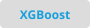
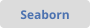

### Hi there! 👋
---
### 👩‍💻 About Me:
- 🔭 I leverage machine learning, data science, and computational science for technology development.

- 📫 How to reach me: 

- 📜 View my portfolio: 

---
### 🖥️ Programming Languages:
   

### 🧰 Machine Learning and Data Science Tools:
                 

### 🛠️ Programming Environments and Tools:
          

<!--
**a-mohan1/a-mohan1** is a ✨ _special_ ✨ repository because its `README.md` (this file) appears on your GitHub profile.

I used these helpful references:
https://www.sitepoint.com/github-profile-readme/
https://towardsdatascience.com/build-a-stunning-readme-for-your-github-profile-9b80434fe5d7
https://github.com/ikatyang/emoji-cheat-sheet/blob/master/README.md
https://unicode.party/
https://img.shields.io/badge/-{LABEL}-informational?style=flat&logo={LOGO}&logoColor={COLOR}&color=DCDCDC

Here are some ideas to get you started:

- 🔭 I’m currently working on ...
- 🌱 I’m currently learning ...
- 👯 I’m looking to collaborate on ...
- 🤔 I’m looking for help with ...
- 💬 Ask me about ...
- 📫 How to reach me: ...
- 😄 Pronouns: ...
- ⚡ Fun fact: ...
-->

